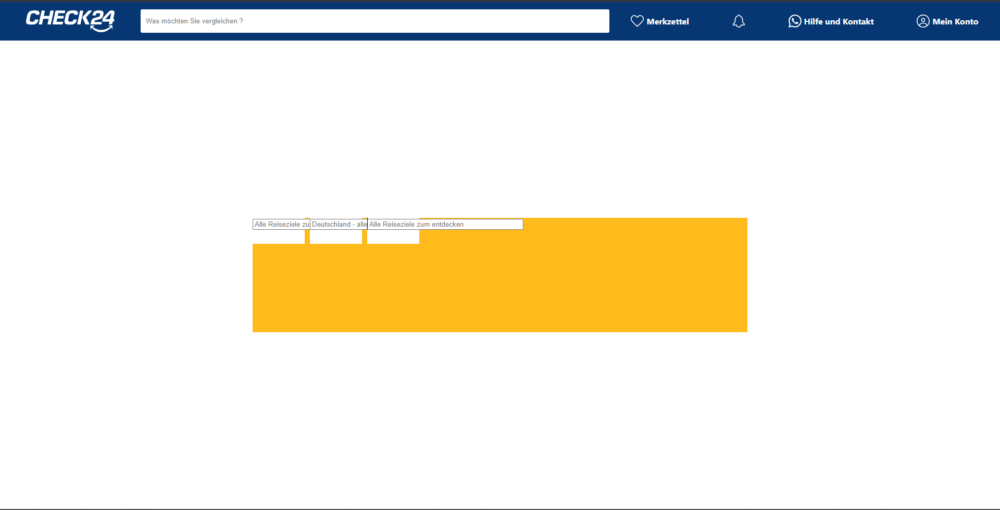

# CHECK24-Holiday
## Protokoll
### 07.11
Vorerst fange ich ich mit einer einfachen Version der Webseite an und versuche mit React und css ,den Front End der Seite so ähnlich wie möglich hinzukriegen.
Fokussieren mich jedoch nicht auf details und versuche das grobe hinzukriegen um mich so schnell wie möglich aufs Backend zu konzentrieren, da mich das sehr interessiert.

### 08.11 
Heute habe ich wenig Zeit gehabt, also habe ich die Front-End Entwicklung und habe den Search-Bar fertig gemacht. Asl nächstes folgt ein kleinen Backend-Test